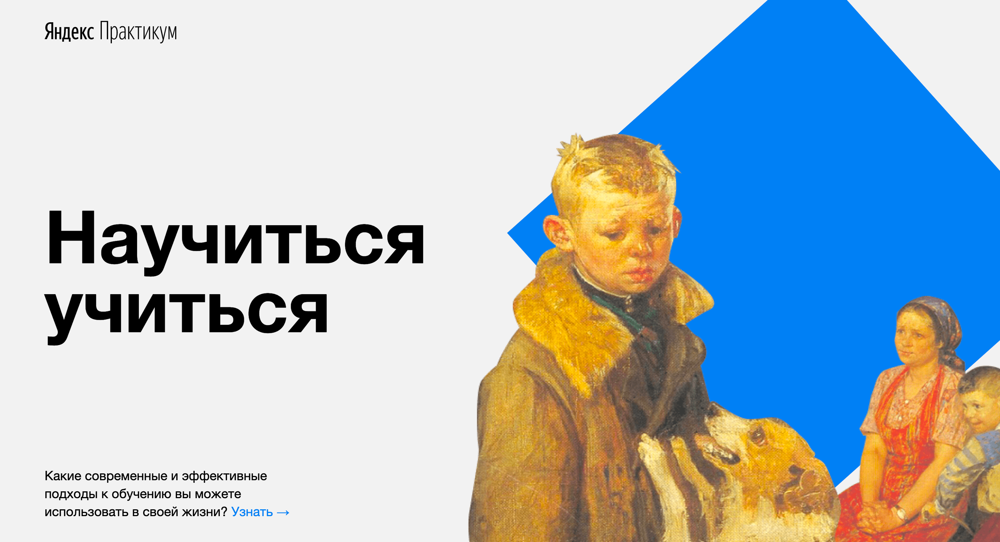

# <h1 align="center">Научиться Учиться</h1>
---

## Описание
---
"Научиться учиться" - это одностроничный сайт с полезной информацией для грамотного подхода к обучению. Сайт написан на html и css. Включает такие разделы, как: 
<ul>
    <li>Главные проблемы в обучении</li>
    <li>Техники обучения</li>
    <li>Видео на Ted</li>
    <li>История Барбары Оакли</li>
    <li>Метод Фейнмана</li>
    <li>Цифры и факты</li>
    <li>Весь мир - школа</li>
    <li>Принципы обучения</li>
    <li>Полезные ресурсы</li>
</ul>

## О проекте
---
Этот сайт, это дополненный предыдущий проект. Отличие в том, что новый, содержит анимации, встроенные видео, трансформирующиеся ссылки и дополнительную информацию.